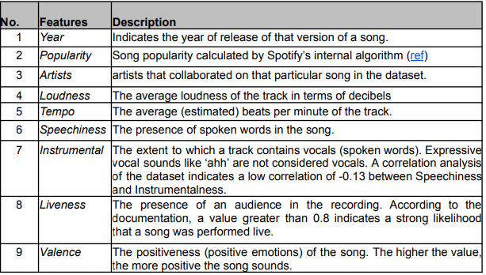
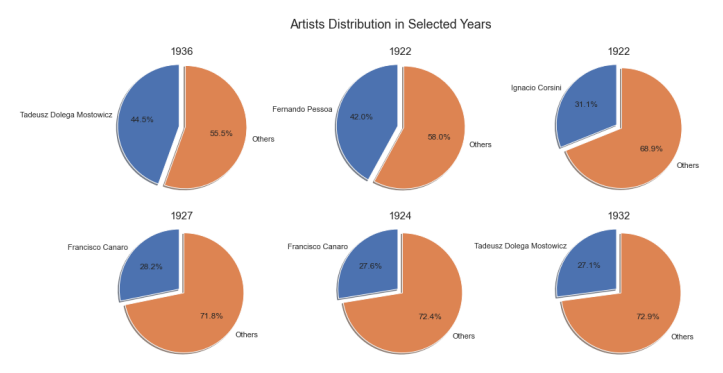
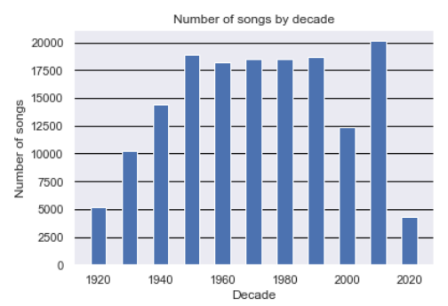
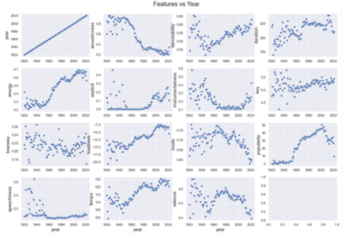
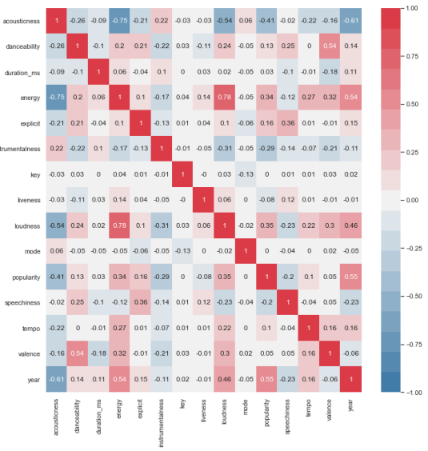
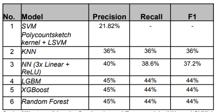

# Songs Decade Prediction

## Introduction
This is a code repository for a data analysis project on predicting which decade a song belonged to. 

## Dataset

The main ‘data.csv’ dataset used in this project contains 174,389 rows and 19 columns. The
columns are a mix of audio features (e.g. loudness, tempo and speechiness), and identifying
information (e.g. song name, artists, year of release).

## Outliers Processing

Dominance of certain artists in the dataset for a given year. Imbalanced dataset.

2% of the song in the dataset had a song duration that is significantly longer than the average duration. 

## Features processing

Distribution of song features across the years

Heatmap on the correlation of the features

## Model Evaluation

Performance result of difference models

